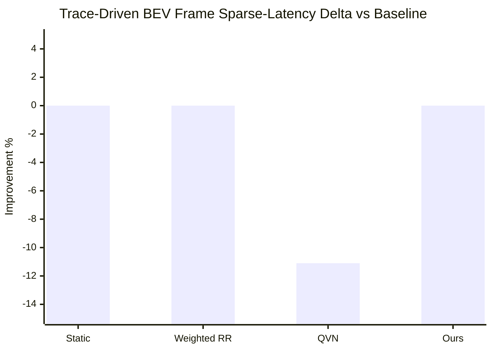

```mermaid
xychart-beta
    title "Trace-Driven BEV Reduce Frame"
    x-axis ["Root-visible packets", "Total flit-hops"]
    y-axis "Count" 0 --> 2600
    bar "Baseline" [1152, 2496]
    bar "INR" [384, 1536]
```

```mermaid
xychart-beta
    title "Trace-Driven BEV Reduce + Dense DMA"
    x-axis ["Sparse latency"]
    y-axis "Cycles" 0 --> 12
    bar "Baseline" [9.1]
    bar "INR" [2.0]
```

# Autonomy Competition Deck Outline

This outline is for a competition demo built around a simulated multi-camera driving scene and the repo's trace-driven NoC benchmark.

## Slide 1. Problem

Title:

Reducing Fusion-Traffic Hotspots In A Multi-Camera NoC

Visual:

- one clean hero still at [docs/figs/carla_town05_junction_hero.png](docs/figs/carla_town05_junction_hero.png)
- one mesh diagram showing six camera branches converging on BEV fusion tiles

Talking points:

- modern perception stacks create many-to-few communication near fusion roots
- the bottleneck is often the on-chip network, not only MAC count
- this project studies how router-side reduction changes that traffic pattern

## Slide 2. Workload

Title:

Trace-Driven BEV Fusion From A Simulated Driving Scene

Visual:

- use `data/noc_traces/carla_town05_junction_scene.json` as the scene summary
- use the annotated still at [docs/figs/carla_town05_junction_annotated.png](docs/figs/carla_town05_junction_annotated.png)
- show the six camera tiles, four BEV tiles, and four head tiles

Talking points:

- the scene comes from a CARLA-style junction workload, not a toy single-stream CNN
- the exporter turns scene complexity into a reproducible packet trace
- the benchmark replays that trace on the same 4x4 mesh used across the repo
- the validated sample CARLA export generates `406` frame packets before optional dense DMA background is added

Command block:

```bash
/Users/joshcarter/MNIST-Accel/.venv/bin/python tools/export_carla_bev_trace.py \
  --input data/noc_traces/carla_town05_junction_scene.json \
  --frame-out data/noc_traces/carla_town05_junction_bev_frame.json \
  --reduce-out data/noc_traces/carla_town05_junction_bev_reduce.json

/Users/joshcarter/MNIST-Accel/.venv/bin/python tools/render_carla_scene_still.py \
    --input data/noc_traces/carla_town05_junction_scene.json \
    --output docs/figs/carla_town05_junction_hero.png \
    --variant hero

/Users/joshcarter/MNIST-Accel/.venv/bin/python tools/render_carla_scene_still.py \
    --input data/noc_traces/carla_town05_junction_scene.json \
    --output docs/figs/carla_town05_junction_annotated.png \
    --variant annotated
```

Real simulator upgrade path:

- if you have access to a supported Ubuntu 22.04 x86_64 or Windows x64 CARLA box, use [docs/guides/CARLA_REAL_CAPTURE_SETUP.md](docs/guides/CARLA_REAL_CAPTURE_SETUP.md)
- capture real assets with `tools/carla_capture_visuals.py` and swap them into the slide in place of the generated placeholders

## Slide 3. Main Result

Title:

Router-Side INR Collapses Fusion Traffic Before The Root

Exact plot:



Talking points:

- on the trace-driven BEV reduce frame, root-visible reduce packets drop by `66.7%`
- total flit-hops drop by `38.5%`
- in the validated CARLA export run, that corresponds to `1152 -> 384` root-visible reduce packets and `2496 -> 1536` flit-hops
- this is the central architectural claim: fewer packets and fewer link traversals before the fusion root

## Slide 4. Latency Under Mixed Traffic

Title:

INR Still Helps Sparse Fusion Traffic Under Dense DMA Background

Exact plot:



Talking points:

- with dense DMA present, sparse latency still improves from `9.1` to `2.0` cycles
- that is a `78.1%` sparse-latency improvement on the reduction path
- flit-hop reduction falls to `7.6%` because dense traffic dominates more of the network
- the right KPI is fusion-path latency and traffic collapse, not whole-network average latency alone

## Slide 5. Allocator Reality Check

Title:

Allocator Tuning Is Secondary; INR Is The Stronger Result

Exact plot:



Talking points:

- the sparse-aware allocator is near-baseline on this workload
- QVN is the bad comparator here: `-10.0%` sparse-latency delta and `-44.6%` throughput with dense DMA
- do not make the allocator the headline result in front of judges

## Slide 6. Why This Matters

Title:

Industry Relevance: Sensor-Fusion Interconnects

Visual:

- one simple list or icon row: camera fusion, radar-camera fusion, zonal SoCs, edge robotics

Talking points:

- the impact is lower hotspot pressure and lower interconnect traffic for aggregation-heavy phases
- the result is relevant to fusion fabrics and distributed perception blocks
- the claim is architectural relevance, not a production automotive tapeout claim

## Slide 7. Demo Flow

Title:

What To Show Live

Live sequence:

1. Play a short CARLA clip or show one still frame.
2. Run the exporter on the scene summary.
3. Run the benchmark with the exported traces.
4. Show the baseline-vs-INR numbers.

Command block:

```bash
NOC_BEV_FRAME_TRACE=data/noc_traces/carla_town05_junction_bev_frame.json \
NOC_BEV_REDUCE_TRACE=data/noc_traces/carla_town05_junction_bev_reduce.json \
/Users/joshcarter/MNIST-Accel/.venv/bin/python tools/noc_allocator_full_comparison.py
```

What to say:

- this is a trace-driven communication demo from a simulated driving scene
- the headline is `66.7%` fewer root-visible reduce packets and `38.5%` fewer flit-hops on the BEV reduction path
- under dense background, sparse fusion latency still drops from `9.1` to `2.0` cycles

What not to say:

- do not say this is a full self-driving stack
- do not say every workload gets faster
- do not say the allocator is the main novelty

## Slide 8. Judge Q and A

If asked why simulation instead of a live camera:

- simulation is the correct proof tool because it gives repeatable scene complexity and repeatable traces
- a live USB camera adds demo risk without improving the NoC claim

If asked why this is not just software:

- the novelty is in how the network hardware transforms reduction traffic before it reaches the root
- the benchmark is modeling the communication path that the RTL feature is designed to accelerate

If asked what the next step is:

- trace the workload from a richer perception stack
- connect the trace-driven benchmark to a more detailed energy model
- expand the RTL corroboration for additional fusion-style traffic patterns