# In-Network Reduction Results

This note turns the corrected focused RTL measurements into paper-ready tables and figure-ready charts, then explains what those numbers do and do not mean for MNIST end-to-end latency.

## Scope

These results combine three validation layers:

- focused RTL multiroot measurements from `tb_innet_reduce_e2e.sv`
- focused explicit-metadata validation from `tb_innet_reduce_metadata.sv`
- full-SoC corroboration from `tb_soc_top_inr.sv`
- full-SoC CSR-programmed metadata corroboration from `tb_soc_top_inr_metadata.sv`

The corrected link metric in the focused RTL bench counts total inter-router flit-hops, not just whether any link was active in a cycle.

## Table 1. Corrected Focused RTL Multiroot Results

| Root Class | Root Node | Baseline Root Packets | INR Root Packets | Root-Packet Delta | Baseline Flit-Hops | INR Flit-Hops | Flit-Hop Delta | Baseline Cycles | INR Cycles | Cycle Delta |
|------------|-----------|-----------------------|------------------|-------------------|--------------------|----------------|-----------------|-----------------|------------|-------------|
| Corner | 0 | 60 | 8 | -86.7% | 192 | 60 | -68.8% | 80 | 84 | +5.0% |
| Edge | 1 | 60 | 12 | -80.0% | 160 | 60 | -62.5% | 80 | 72 | -10.0% |
| Interior | 5 | 60 | 16 | -73.3% | 128 | 60 | -53.1% | 80 | 60 | -25.0% |

### Figure 1. Root-Visible Reduction Packets

```mermaid
xychart-beta
    title "Root-Visible Reduce Packets Across Root Placements"
    x-axis ["Corner-0", "Edge-1", "Interior-5"]
    y-axis "Packets over 4 groups" 0 --> 60
    bar "Baseline" [60, 60, 60]
    bar "INR" [8, 12, 16]
```

### Figure 2. Inter-Router Flit-Hops

```mermaid
xychart-beta
    title "Inter-Router Flit-Hops Across Root Placements"
    x-axis ["Corner-0", "Edge-1", "Interior-5"]
    y-axis "Flit-hops over 4 groups" 0 --> 200
    bar "Baseline" [192, 160, 128]
    bar "INR" [60, 60, 60]
```

## What Table 1 Shows

- Root-visible traffic always drops because the root no longer sees all 15 raw contributors for each group.
- The remaining root-visible packet count depends on root geometry under XY routing.
- A corner root sees one merged partial from each of 2 inbound branches per group.
- An edge root sees one merged partial from each of 3 inbound branches per group.
- An interior root sees one merged partial from each of 4 inbound branches per group.
- Baseline flit-hops depend on Manhattan distance to the root, so corner roots pay the highest total hop cost.
- INR collapses all three root placements to the same 60 flit-hops because the total cost becomes tree-edge cost rather than distance-to-root cost.

For 16 nodes and 4 groups, that fixed cost is:

- 15 tree edges per group
- 4 groups
- 15 x 4 = 60 total flit-hops

That is the main corrected RTL takeaway: router-side INR removes the root-placement penalty from total reduction traffic.

## Table 2. Explicit Subtree Metadata Validation

This second benchmark is the first focused case that cannot be handled by geometry-only subtree inference.

Workload:

- active sources are the sparse subset `{1, 4, 5}`
- reduction root is node `0`
- each group sums `1 + 4 + 5 = 10`

Programmed metadata targets:

- node `1` target = `1`
- node `5` target = `1`
- node `4` target = `2`

Geometry-only inferred targets would be larger (`3`, `3`, and `12` respectively), so a pure XY-derived router policy would wait for contributors that do not exist in this sparse subset.

| Workload | Mode | Root Packets | Flit-Hops | Cycles | Result |
|----------|------|--------------|-----------|--------|--------|
| Sparse subset `{1,4,5}` to root `0` | Baseline | 12 | 16 | 32 | correct final sum = 10 |
| Sparse subset `{1,4,5}` to root `0` | Metadata-programmed INR | 8 | 12 | 48 | correct final sum = 10 |

### What Table 2 Means

- The new metadata path lets routers complete reduction groups based on explicit per-group local targets instead of only on XY geometry.
- That extends the architecture beyond pure XY-rooted all-to-one trees.
- The current implementation uses a sideband router configuration path keyed by `reduce_id`.
- The metadata table is now exposed through the tile-array accelerator CSR window, so firmware or a SoC-level test can program router-local targets without direct testbench wiring.

## Table 3. Full-SoC CSR-Programmed Metadata Corroboration

This regression closes the gap between the focused metadata proof and the integrated SoC path.

Programming path:

- full `soc_top_v2` instantiation with `INNET_REDUCE=1`
- metadata programmed through the accelerator tile-array CSR window
- CSR window fields: router select, `reduce_id`, target, control/apply, and status readback

Workload:

- active sources are the sparse subset `{1, 4, 5}`
- reduction root is node `0`
- 4 reduction groups are injected through the live tile-array mesh

| Bench | Programming Path | CSR Readback | Root Packets | Flit-Hops | Result |
|-------|------------------|--------------|--------------|-----------|--------|
| `tb_soc_top_inr_metadata.sv` | accelerator CSR window | pass | 8 | 12 | all 4 groups correct, final sum = 10 |

### What Table 3 Means

- The metadata path is no longer only a focused RTL sideband feature.
- A live SoC build can now program the router-local subtree table through the accelerator CSR aperture and then run the sparse-subset reduction end to end.
- The corroborating SoC result preserves the same root-packet collapse as the focused metadata bench: `12` baseline root packets become `8` metadata-programmed INR root packets over 4 groups.

## Model vs RTL

The Python model and the RTL are measuring different things.

The model is best understood as a traffic model:

- how many packets reach the root
- how many flit-hops occur in the fabric
- how traffic mix changes under contention

The RTL is a timing model for the implemented microarchitecture:

- credit backpressure
- router pipeline timing
- merge staging inside the reduction tree
- root-sink acceptance and commit timing
- serialization between groups in the focused benches

That means a large traffic win does not automatically become a large cycle win.

Examples from the RTL:

- corner-root XY case: flit-hops drop by 68.8%, but cycles get 5.0% worse because merge staging adds delay on a long serialized path
- sparse-subset metadata case: flit-hops drop by 25.0%, but cycles get worse because the benchmark is tiny and the merge overhead is not amortized
- interior-root XY case: both traffic and cycles improve because the tree is balanced enough that reduced root pressure dominates the merge cost

So the correct reading is:

- traffic reduction is a network-efficiency result
- latency reduction is a workload-and-geometry result

They are related, but they are not the same metric.

## Why MNIST End-to-End Gain Is Smaller Than Raw NoC Traffic Gain

The key point is that INR only accelerates the reduction-heavy part of the inference graph, not the whole model.

For the current MNIST mapping:

- `conv1` and `conv2` are output-partitioned plus scatter-heavy phases
- `fc1` is the main K-split reduction phase
- `fc2` runs on a single tile

So INR helps `fc1` communication directly, but it does not directly speed up:

- the convolution MAC pipelines
- conv scatter phases
- single-tile classifier work
- unrelated DMA and barrier overheads

There are two separate effects:

1. INR reduces network work inside the reduction phase.
2. End-to-end MNIST latency only improves in proportion to how much total runtime that phase occupies.

An Amdahl-style approximation makes this clearer:

`overall_speedup = 1 / ((1 - f) + f / s)`

where:

- `f` is the fraction of total inference time spent in the reduction-heavy phase
- `s` is the speedup of that phase

Examples:

- if reduction-heavy time is only 15% of inference and INR makes that phase 1.33x faster, total speedup is only about 1.04x
- if reduction-heavy time is 30% of inference and INR makes that phase 1.33x faster, total speedup is only about 1.08x

So even a very strong network result can turn into a modest model-level latency result.

That is exactly why the corrected RTL data should be presented as:

- strong proof of root-hotspot relief and flit-hop reduction
- selective latency improvement depending on root placement and workload structure
- a direct benefit to `fc1`-style K-split phases in MNIST, not a blanket acceleration of the entire CNN

## Table 4. MNIST Layer Timing Breakdown

Using the current layer estimates from `docs/DEEP_DIVE.md`, the model-level time budget is dominated by `fc1`, but not entirely determined by it.

| Layer | Estimated Cycles | Share of Total | INR Relevance |
|-------|------------------|----------------|---------------|
| `conv1` | 440 | 1.2% | low |
| `conv2` | 13.2K | 35.5% | low to indirect |
| `fc1` | 23.5K | 63.2% | primary |
| `fc2` | 34 | 0.1% | none |
| **Total** | **37.2K** | **100%** | |

The practical reading is:

- `fc1` is the only layer where INR directly matches the K-split reduction pattern.
- `fc1` is a majority of the cycle budget, but about `36.8%` of inference still sits outside that layer.
- So even a strong `fc1`-local gain must be diluted at whole-model level.

### From FC1-Local Gain to Whole-Inference Gain

The table below is an Amdahl-style mapping, not a measured RTL claim. It answers the paper question: if INR improves the whole `fc1` layer by a factor `s`, what is the corresponding whole-inference gain?

| Assumed `fc1`-Local Speedup | Whole-Inference Speedup | Whole-Inference Cycle Reduction |
|-----------------------------|-------------------------|---------------------------------|
| 1.10x | 1.06x | -5.8% |
| 1.20x | 1.12x | -10.5% |
| 1.33x | 1.19x | -15.7% |

That table is intentionally optimistic because it assumes the entire `fc1` layer scales with INR. In reality, only the communication-sensitive part of `fc1` is directly affected, so the measured whole-model gain should normally be smaller than those mapped values.

## Table 5. Autonomy-Oriented BEV Fusion Results

To evaluate a workload that looks more like an autonomy SoC than MNIST, the benchmark suite now includes two multi-camera BEV-fusion variants:

- a structured synthetic `nuScenes mini`-style workload embedded in `tools/noc_allocator_full_comparison.py`
- a trace-driven frame replay loaded from `data/noc_traces/nuscenes_mini_bev_frame.json` and `data/noc_traces/nuscenes_mini_bev_reduce.json`

The trace-driven path is still a compact modeled trace, not a replay of raw downloaded nuScenes tensors. The value is that the workload now lives in repo data and can be replayed deterministically for demos and comparisons.

### Table 5A. Allocator QoS Summary On BEV Fusion

| Workload | StaticPrio Sparse-Lat Delta | StaticPrio Throughput Delta | QVN Sparse-Lat Delta | QVN Throughput Delta | Ours Sparse-Lat Delta | Ours Throughput Delta |
|----------|-----------------------------|-----------------------------|----------------------|----------------------|-----------------------|-----------------------|
| Synthetic BEV fusion | +0.6% | -44.8% | -6.7% | -33.8% | +0.1% | +0.0% |
| Synthetic BEV fusion + dense DMA | +0.0% | +0.0% | -0.2% | -48.7% | +0.0% | +0.0% |
| Trace-driven BEV frame | +0.0% | +0.0% | -11.1% | +0.0% | +0.0% | +0.0% |
| Trace-driven BEV frame + dense DMA | +0.0% | +0.0% | -11.1% | -44.7% | +0.0% | +0.0% |

### What Table 5A Means

- The adaptive sparse-aware allocator remains near-baseline on the BEV workloads.
- Static priority still risks severe dense starvation in the synthetic BEV case.
- QVN remains the clearest bad fit because rigid partitioning hurts sparse latency and, in mixed traffic, can also crater throughput.
- The autonomy benchmark therefore does not rescue the allocator story. The allocator remains a secondary novelty.

### Table 5B. Router-Side INR Summary On BEV Fusion

| Workload | Reduce-Packet Elimination | Flit-Hop Reduction | Baseline Sparse Latency | INR Sparse Latency | Sparse-Latency Improvement |
|----------|---------------------------|--------------------|-------------------------|--------------------|----------------------------|
| Synthetic BEV fusion reduce | +66.7% | +38.5% | 36.8 | 2.0 | +94.6% |
| Synthetic BEV fusion reduce + dense DMA | +66.7% | +7.6% | 4.7 | 2.0 | +57.4% |
| Trace-driven BEV reduce frame | +66.7% | +38.5% | 4.3 | 2.0 | +53.8% |
| Trace-driven BEV reduce + dense DMA | +66.7% | +7.6% | 9.1 | 2.0 | +78.1% |

### What Table 5B Means

- Router-side INR still removes two-thirds of root-visible reduction packets on the autonomy topology.
- The link-level traffic benefit is strong when reduction dominates and naturally shrinks when dense DMA becomes a larger part of the load.
- The trace-driven replay preserves the same packet-collapse and flit-hop trends as the structured synthetic case, which makes it a better competition/demo artifact because the workload is externalized and reproducible.
- The correct autonomy claim is still network efficiency for aggregation-heavy fusion, not blanket acceleration of all traffic classes.

## What Can Now Be Claimed

Supported by current RTL and tests:

- XY multiroot all-to-one reduction now has focused corner, edge, and interior measurements plus a full-SoC root-5 regression.
- Router-side reduction can now consume explicit per-group subtree metadata through a live sideband configuration path.
- A sparse-subset tree that geometry-only inference would not complete now passes in focused RTL when metadata is programmed.
- The same sparse-subset tree now also passes in a full-SoC regression where the metadata table is programmed through the accelerator CSR window.

Still not yet fully claimed:

- broad performance characterization for arbitrary software-programmed trees
- broad performance claims for all sparse subsets or all traffic mixes
- whole-model MNIST speedups equal to the raw NoC traffic reduction numbers